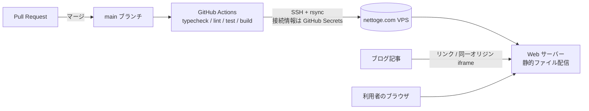

# DEPLOY — nettoge.com への設置設計

- 文書ステータス: Draft v0.1
- 前提: [SPEC.md](./SPEC.md)
- 公開先: ブログ **nettoge.com** が動いているレンタル VPS。アプリはビルド済みの静的ファイル（HTML / JS / CSS）だけで動くため、サーバー側に Node.js や DB は不要。

## 1. 全体構成



- デプロイは **main へのマージ時に自動**、または Actions 画面から手動実行（`workflow_dispatch`）。
- PR の段階ではビルドとテストのみ行い、サーバーへは送らない（フォークからの PR に Secrets は渡らない）。
- GitHub Pages は使用しない。

## 2. 公開 URL とベースパス

| 項目 | 値 |
|------|----|
| 公開 URL（案） | `https://nettoge.com/tools/ff14-rotation-trainer/` — TODO(DEPLOY-01) 確定 |
| Vite の `base` | 環境変数 `VITE_BASE` で指定（既定は上記パス）。パス変更はワークフローの変数変更のみで済む |
| ルーティング | ハッシュルーティング（`#/...`）。サーバーのリライト設定が不要で、ブログ側の URL 設定（WordPress のパーマリンク等）と衝突しない |
| 共有 URL | `https://nettoge.com/tools/ff14-rotation-trainer/#/share?d=...` |

## 3. サーバー上の配置（リリース切り替え方式）

途中まで上書きされた状態を利用者に見せないため、リリースごとにディレクトリを分け、最後にシンボリックリンクを切り替える。

```
<DEPLOY_ROOT>/                       例: /var/www/ff14-rotation-trainer
├─ releases/
│   ├─ 20260924-1203-<commit7>/      ビルド成果物（dist/ の中身）
│   └─ 20260925-0911-<commit7>/
└─ current -> releases/20260925-0911-<commit7>

Web サーバーの公開パス /tools/ff14-rotation-trainer/ → <DEPLOY_ROOT>/current
```

デプロイ手順（ワークフローが実行）:

1. `npm ci` → テスト → `VITE_BASE=... npm run build`
2. `rsync -a --delete dist/ <user>@<host>:<DEPLOY_ROOT>/releases/<id>/`
3. `ln -sfn releases/<id> <DEPLOY_ROOT>/current.tmp && mv -Tf current.tmp current`（アトミックに切り替え）
4. 公開 URL の `index.html` を取得して HTTP 200 を確認（スモークチェック）
5. 古いリリースを削除（直近 5 件を残す）

ロールバック: `current` を 1 つ前のリリースへ向け直す（手動実行用のワークフロー入力 `rollback_to` を用意）。

## 4. 接続情報の扱い

> **接続情報（ホスト・ユーザー・鍵・パスワード）はチャットや Issue、コードに書かない。**
> サイト管理者が GitHub のリポジトリ設定で **Secrets** に登録し、ワークフローだけがそれを使う。

### 4.1 サーバー側の準備（管理者が実施）

1. デプロイ専用ユーザーを作る（例: `deploy-ff14rt`）。sudo 権限なし。
2. `<DEPLOY_ROOT>` を作成し、所有者をデプロイ専用ユーザーにする。Web サーバーのユーザーには読み取り権限だけ付ける。
3. デプロイ専用の SSH 鍵ペア（ed25519、パスフレーズなし）を**手元で**作り、公開鍵をデプロイ専用ユーザーの `authorized_keys` に登録する。
   - 可能なら `restrict` オプションと `rrsync`（rsync 用の制限スクリプト）で、この鍵を `<DEPLOY_ROOT>` への rsync と切り替えコマンドだけに制限する。
4. Web サーバーに `/tools/ff14-rotation-trainer/` → `<DEPLOY_ROOT>/current` の配信設定を追加する（§5）。

### 4.2 GitHub 側の設定（管理者が実施）

リポジトリの **Settings → Environments** で `production` 環境を作り、その環境の Secrets / Variables に登録する。

| 種別 | 名前 | 内容 |
|------|------|------|
| Secret | `DEPLOY_HOST` | VPS のホスト名または IP |
| Secret | `DEPLOY_PORT` | SSH ポート |
| Secret | `DEPLOY_USER` | デプロイ専用ユーザー名 |
| Secret | `DEPLOY_SSH_KEY` | デプロイ専用の秘密鍵 |
| Secret | `DEPLOY_KNOWN_HOSTS` | `ssh-keyscan` で取得し、指紋を確認済みのホスト鍵（中間者攻撃対策） |
| Variable | `DEPLOY_ROOT` | 例 `/var/www/ff14-rotation-trainer` |
| Variable | `PUBLIC_URL` | 例 `https://nettoge.com/tools/ff14-rotation-trainer/` |
| Variable | `VITE_BASE` | 例 `/tools/ff14-rotation-trainer/` |

- `production` 環境に「必須レビュアー（Required reviewers）」を設定すれば、デプロイ前に承認ボタンを押す運用にもできる（任意）。
- ワークフローは `main` への push と手動実行でのみ `production` 環境を使う。

### 4.3 SSH に IP 制限をかけている場合

GitHub が用意する Actions の実行環境（GitHub-hosted runner）は IP アドレスが一定でない。SSH を特定 IP に絞っている場合は、次のどれかを選ぶ（TODO(DEPLOY-03)）。

| 案 | 内容 |
|----|------|
| A | デプロイ専用ユーザーだけ鍵認証で全 IP を許可し、鍵の権限を §4.1-3 で最小化する |
| B | 手動アップロード: Actions がビルド成果物（zip）を作り、管理者がダウンロードしてサーバーに置く |
| C | VPS 上に self-hosted runner を置く（VPS 側で常駐プロセスが必要。公開リポジトリでは非推奨） |

## 5. Web サーバー設定

サーバーソフト（nginx / Apache）は TODO(DEPLOY-02)。どちらの場合も、ブログ本体の設定に**この場所（location / Alias）だけ**を追加する。

| 対象 | 設定 |
|------|------|
| `index.html` | `Cache-Control: no-cache`（更新がすぐ反映されるように） |
| `assets/*`（ファイル名にハッシュ付き） | `Cache-Control: public, max-age=31536000, immutable` |
| 圧縮 | gzip または brotli を有効化 |
| セキュリティヘッダー（このパスのみ） | `Content-Security-Policy: default-src 'self'; img-src 'self' data:; style-src 'self' 'unsafe-inline'; frame-ancestors 'self'`、`X-Content-Type-Options: nosniff`、`Referrer-Policy: same-origin` |

nginx の例:

```nginx
# ハッシュ付きアセット（長期キャッシュ）
location ^~ /tools/ff14-rotation-trainer/assets/ {
    alias /var/www/ff14-rotation-trainer/current/assets/;
    add_header Cache-Control "public, max-age=31536000, immutable" always;
    add_header X-Content-Type-Options "nosniff" always;
}

# index.html など（毎回確認）
location /tools/ff14-rotation-trainer/ {
    alias /var/www/ff14-rotation-trainer/current/;
    index index.html;
    add_header Cache-Control "no-cache" always;
    add_header Content-Security-Policy "default-src 'self'; img-src 'self' data:; style-src 'self' 'unsafe-inline'; frame-ancestors 'self'" always;
    add_header X-Content-Type-Options "nosniff" always;
    add_header Referrer-Policy "same-origin" always;
}
```

Apache の例（`.htaccess` ではなくサーバー設定側に記述）:

```apache
Alias /tools/ff14-rotation-trainer/ /var/www/ff14-rotation-trainer/current/
<Directory /var/www/ff14-rotation-trainer/current/>
    Options -Indexes +FollowSymLinks
    Require all granted
    Header set Cache-Control "no-cache"
    Header set Content-Security-Policy "default-src 'self'; img-src 'self' data:; style-src 'self' 'unsafe-inline'; frame-ancestors 'self'"
    Header set X-Content-Type-Options "nosniff"
    Header set Referrer-Policy "same-origin"
</Directory>
# ハッシュ付きアセットは長期キャッシュ（上の設定を上書き）
<Directory /var/www/ff14-rotation-trainer/current/assets/>
    Header set Cache-Control "public, max-age=31536000, immutable"
</Directory>
```

> 例は設計段階のもので、実際の設定は DEPLOY-02 の確定後にサーバーで `nginx -t` / `apachectl configtest` を通してから反映する。

## 6. ブログとの連携

| 方法 | 内容 | 備考 |
|------|------|------|
| リンク（既定） | 記事からツールの URL へリンク。ツールは単独ページとして全画面で動く | 最も確実。スマートフォンでも画面を広く使える |
| 同一オリジン iframe | 記事内に `<iframe src="/tools/ff14-rotation-trainer/?embed=1" allow="gamepad; fullscreen">` を貼る（パッドを使うには `allow="gamepad"` が必要） | `embed=1` で見出しを省いた小さい表示＋「全画面で開く」ボタン。キー入力は iframe をクリック/タップしてフォーカスを移してから有効になる旨を表示 |

- 記事から特定の練習設定を開くリンクは共有 URL（`#/share?d=...`）で作れる。
- ツールページの見出しとフッターに「nettoge.com トップ」「解説記事」へのリンクを置く（リンク先 URL はデータではなく設定ファイル `site.config.ts` に書く）。

## 7. 同じドメインで動かすことによる注意

| 点 | 対応 |
|----|------|
| localStorage はブログと共有（同一オリジン） | キーはすべて `ff14rt:` で始め、他のキーを読み書き・削除しない。「データを消去」は `ff14rt:` だけを対象にする |
| 保存容量もブログと共有 | 目標 1MB 以内（SPEC §9）。容量超過時はメモリ上で動作を続けて通知 |
| ブログの CSS・JS | ツールは独立した HTML なので影響を受けない（iframe 埋め込み時も iframe 内は独立） |
| 広告・アクセス解析 | MVP のツールページには入れない（外部通信なしの方針）。入れる場合は CSP と SPEC §3 の見直しが必要 — TODO(DEPLOY-04) |

## 8. 未確定事項

| ID | 内容 |
|----|------|
| DEPLOY-01 | 公開パス（`/tools/ff14-rotation-trainer/` で良いか） |
| DEPLOY-02 | Web サーバーの種類（nginx / Apache / その他）と、設定ファイルを編集できるか |
| DEPLOY-03 | SSH の IP 制限の有無、自動デプロイ（§4.3 案 A）か手動アップロード（案 B）か |
| DEPLOY-04 | ツールページに広告・アクセス解析を入れるか |
| DEPLOY-05 | 本番前に確認するステージング（例: `/tools/ff14-rotation-trainer-staging/`）が必要か |
