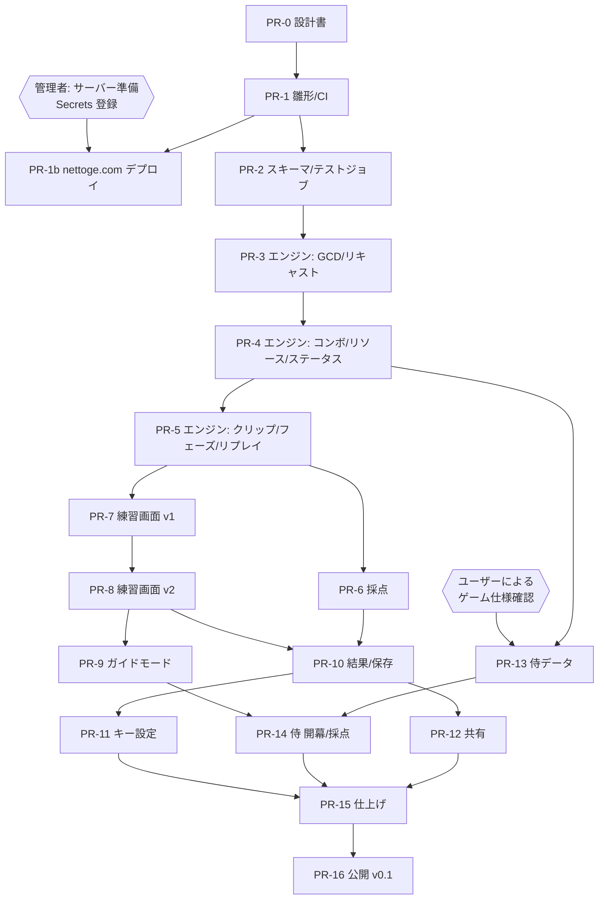

# DEV_PLAN — 開発計画（小さな Pull Request への分割）

- 文書ステータス: Draft v0.1
- 前提: [SPEC.md](./SPEC.md) ほか設計書一式。公開先は nettoge.com（[DEPLOY.md](./DEPLOY.md)）

## 1. 進め方のルール

| ルール | 内容 |
|--------|------|
| PR の大きさ | 1 PR = 1 つの関心事。目安はテスト・データを除いて差分 400 行以内 |
| テスト同梱 | ロジックを追加する PR は、[TEST_PLAN.md](./TEST_PLAN.md) の該当 ID のテストを同じ PR に含める |
| CI 必須 | `typecheck` / `lint` / `test` / `build` がすべて緑でなければマージしない |
| 設計書の更新 | 仕様・スキーマ・状態遷移を変える PR は、同じ PR で `docs/` を更新する |
| ゲーム値の扱い | 侍の値を入れる PR（PR-13, 14）以外で、ゲーム仕様の値をリポジトリに追加しない。開発は架空テストジョブで行う |
| 依存の追加 | 実行時依存は React / zod のみを想定。追加する場合は PR 説明に理由を書く |

## 2. PR 一覧

| # | タイトル（案） | 内容 | 主なテスト | 依存 |
|---|--------------|------|-----------|------|
| PR-0 | 設計書 | `docs/` 一式（本 PR） | — | — |
| PR-1 | プロジェクト雛形と CI | Vite + React + TS（strict）、Vitest、ESLint、Prettier、`VITE_BASE` による `base` 設定、ハッシュルーター骨組み、非公式表記フッター、GitHub Actions（CI のみ） | スモークテスト 1 本、S-01, S-04 | PR-0 |
| PR-1b | nettoge.com デプロイワークフロー | SSH + rsync によるリリース切り替え方式のデプロイ、スモークチェック、ロールバック入力、`embed=1` 表示の骨組み。Web サーバー設定例の確定 | ワークフローの手動実行で M-09, M-12 | PR-1, **管理者によるサーバー準備と Secrets 登録（DEPLOY.md §4）** |
| PR-2 | データスキーマとローダー、テストジョブ | `src/data/schema/*`（zod）、`loader.ts`（ドラフト判定・不足 TODO 一覧）、`_testjob` データ | D-01〜D-08, D-10 | PR-1 |
| PR-3 | エンジン: 時間・GCD・ロック・キュー・リキャスト | `SimState`、`advanceTo` / `input`、同時刻の処理順序、チャージ機構、イベント出力 | U-GCD-01〜07, U-CD-01〜05 | PR-2 |
| PR-4 | エンジン: 条件・効果・コンボ・リソース・ステータス | Condition / Effect 評価器、コンボ状態、ゲージ/フラグ、ステータスの付与・更新・期限、ボタン置き換え | U-CMB-*, U-RES-*, U-ST-*, U-BTN-01 | PR-3 |
| PR-5 | エンジン: クリップ/停止判定・フェーズ・リプレイ | §3.1.1 の判定、ウィーブ数、カウントダウン/プリプル/終了処理、`simulate(config, data, log)` | U-CLIP-*, U-PHASE-*, U-REPLAY,（任意）プロパティテスト | PR-4 |
| PR-6 | 採点モジュール | 8 項目の算出、重み正規化、ランク、`ScoringProfile` スキーマ | SC-01〜10 | PR-5 |
| PR-7 | 練習画面 v1（最小操作） | セッション状態機械、`Clock` 注入の rAF ループ、3 秒カウントダウン、経過時間、GCD 表示、スキルボタン、既定キーバインド、一時停止/中断/リトライ | C-01〜04 | PR-5 |
| PR-8 | 練習画面 v2（状態表示） | ジョブゲージ、バフ/デバフ、コンボ表示、ミス理由、タイムライン、入力履歴 | C-05 | PR-7 |
| PR-9 | ガイド練習モード | お手本時刻の算出（最速入力シミュレーション）、次スキル表示、ブロック/続行、再同期、速度倍率 | U-GUIDE-01〜03, C-06, D-09 | PR-8 |
| PR-10 | 結果画面と localStorage | 結果画面、`storage.ts`（検証・退避・容量超過対応）、履歴、前回/ベスト比較 | C-07, SH-06, SH-07, SH-09 | PR-6, PR-8 |
| PR-11 | キーバインド設定画面 | 変更・重複警告・既定に戻す・保存 | C-03, C-08 | PR-10 |
| PR-12 | 共有（URL / JSON） | エンコード/デコード、`#/share` 読込確認画面、JSON 保存/読込、入力検証とサイズ上限 | SH-01〜05 | PR-10 |
| PR-13 | 侍 Lv100 データ（アクション・ステータス・ゲージ） | **出典付きで確認できた値のみ** 入力。未確認は `null` のまま | D-*（侍データ）、SCHEMA-01 の検証 | PR-4, **ユーザーによる仕様確認** |
| PR-14 | 侍 Lv100 開幕回し・採点プロファイル | 開幕回しデータ（出典付き）、`scoring.json`（主要アクション・維持対象） | D-08, D-09（侍） | PR-13, PR-9 |
| PR-15 | レスポンシブ・アクセシビリティ仕上げ | スマートフォン最適化、`aria-live`、reduced-motion、Wake Lock、S7 データ出典画面 | C-09, M-01〜10 | PR-12, PR-14 |
| PR-16 | 公開 v0.1 | README（使い方・非公式表記・出典）、リリースノート、ブログ記事からのリンク/埋め込みコード例 | M-09, M-11 | 全部 |

## 3. 依存関係

- PR-6（採点）と PR-7〜9（UI）は並行して進められる。
- PR-13（侍データ）はエンジンの表現力（PR-4）が揃えば、UI と並行して進められる。ボトルネックは **ゲーム仕様の確認作業**。

## 4. マイルストーン

| マイルストーン | 含む PR | できること |
|---------------|--------|-----------|
| M1: 動く骨組み | PR-1〜5, PR-1b | テストジョブでエンジンがテスト上動く。nettoge.com に雛形が公開される |
| M2: 遊べる試作 | PR-6〜10 | 開発ビルドでテストジョブを使った練習・採点・履歴 |
| M3: 共有と設定 | PR-11, 12 | キー変更・URL 共有 |
| M4: 侍対応 | PR-13, 14 | 侍 Lv100 で開幕回し練習（確認済みデータの範囲で） |
| M5: 公開 v0.1 | PR-15, 16 | スマートフォン/PC で公開 |

> 公開ページ（nettoge.com）は PR-1b から自動デプロイするが、侍データが `verified` になるまでは「データ未整備」表示となり練習は開始できない（テストジョブは開発ビルドのみ）。

## 5. ユーザー判断が必要な事項

実装を進める前、または該当 PR までに決めてほしい事項。

| # | 事項 | 選択肢（案） | 期限 |
|---|------|------------|------|
| Q1 | ゲームデータの出典ポリシー | (a) 公式情報のみ (b) 公式 + 有名コミュニティ攻略（出典明記） | PR-13 |
| Q2 | GCD 値の扱い（GAME-02） | (a) スキルスピードから計算 (b) 「GCD 値」を直接選ぶ（例: 実ゲームの表示値を入力） | PR-3（エンジンは両対応可能な設計。既定値の決め方のみ） |
| Q3 | 効果の付与タイミング（GAME-09） | (a) 使用時に即時付与で近似 (b) 遅延をデータで持つ | PR-4 |
| Q4 | 方向指定（GAME-20） | (a) MVP は常に成功 (b) 方向を選ぶ UI を作る | PR-13 |
| Q5 | 採用する開幕回し（GAME-31） | 出典を 1 つ以上指定 | PR-14 |
| Q6 | テストジョブを公開ページでも「デモ（架空ジョブ）」として触れるようにするか | (a) 開発ビルドのみ（現設計）(b) 公開ページでデモとして表示 | PR-7 |
| Q7 | 非公式表記の文面（LEGAL-01） | — | PR-16 |
| Q8 | 公開パス・Web サーバー種別（DEPLOY-01, 02） | 例 `/tools/ff14-rotation-trainer/`、nginx / Apache | PR-1b |
| Q9 | 自動デプロイか手動アップロードか（DEPLOY-03） | (a) GitHub Actions から SSH で自動 (b) Actions が作る zip を手動で設置 | PR-1b |
| Q10 | ツールページに広告・アクセス解析を入れるか（DEPLOY-04） | (a) 入れない（現設計）(b) 入れる（CSP と外部通信方針を見直し） | PR-16 |

## 6. 侍データ入力（PR-13）の作業手順

1. [SPEC.md §10](./SPEC.md#10-未確認ゲーム仕様一覧todo) の TODO をチェックリスト化した Issue を作る。
2. 出典ごとに `DataSource` を登録。
3. アクション → ステータス → リソース → ボタンの順に入力し、1 件ずつ `verification` を更新。
4. `DataSchema` で表せない仕様が見つかったら、データを無理に合わせず TODO(SCHEMA-01) として記録し、エンジン側の型追加 PR を別に切る。
5. D- テストを通し、可能なら実ゲームで開幕回しを確認して PR に記録。
