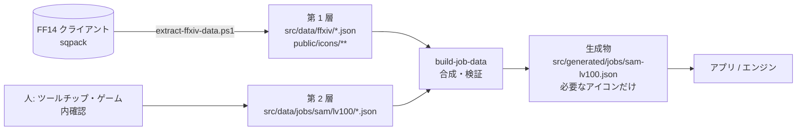

# GAME_DATA — ゲームデータの 2 層構成

- 文書ステータス: Draft v0.2
- 前提: [ffxiv-data.md](./ffxiv-data.md)（クライアントからの抽出手順）、[DATA_SCHEMA.md](./DATA_SCHEMA.md)
- 対象クライアント: `src/data/ffxiv/meta.json` の `gameVersion.ffxiv`（2026-09-24 抽出時点 `2026.09.15.0000.0000`）

## 1. 方針

ゲームデータは次の 2 層で持ち、ビルド時に 1 つのジョブデータへ合成する。

| 層 | 場所 | 作り方 | 中身 |
|----|------|--------|------|
| **第 1 層: 抽出データ** | `src/data/ffxiv/*.json`、`public/icons/**` | `scripts/extract-ffxiv-data.ps1` で**自動生成**。手で編集しない | 名称・説明文・アイコン・GCD/oGCD・詠唱・リキャスト基本値・リキャスト共有・コンボの前後・レベルによる上位版への変化・ボタン置き換え先・コストの生の値 |
| **第 2 層: 補足データ** | `src/data/jobs/<job>/lv<level>/*.json` | **人が書く**。1 つの値ごとに出典を付ける | ゲージの増減量・ステータスの効果時間と効果・ボタン置き換えの条件・特性で変わる値（チャージ数やヘイスト）・ボタン配置・開幕回し |

- アクションとステータスは **ゲーム内の ID（数値）** で参照する（例: 刃風 = 7477）。第 2 層にアクション名は書かない。名前は第 1 層から引く。
- 第 1 層に値があるなら、第 2 層では**上書きしない**のが原則。特性で変わる値など、どうしても上書きが必要なときは、`override` に理由と出典を付けて書く（§4.3）。
- 第 1 層の秒単位の値は、合成時に整数 ms へ変換する（`Math.round(sec * 1000)`）。



### 1.1 生成物を分ける理由

- `actions.json` は全ジョブ分で 1.8MB、アイコンは合計 13MB ある。そのまま配信せず、**対象ジョブ・レベルで使う分だけ**を生成物にする。
- 生成スクリプト（`scripts/build-job-data.ts`）は `npm run build` の前に自動で実行する。生成物はコミットしない（`.gitignore`）。
- アイコンは、生成物が参照するものだけを `dist/icons/` にコピーする。侍 Lv100 で使うのはおよそ数十枚。

## 2. 侍 Lv100 で第 1 層から取れるもの（2026-09-24 抽出で確認）

`jobs.json` の SAM の `actionIds` から、`inActionList || isRoleAction` のものを選ぶと 45 件ある。
第 1 層で何が埋まるかを、SPEC §10 の TODO と対応させて整理する。

| 項目 | 第 1 層 | 例・注意 | 残る TODO |
|------|---------|---------|-----------|
| アクション名（日本語/英語） | ✅ `name` | 刃風 / Hakaze | — |
| 説明文 | ✅ `description` | 最大レベルで評価済み。第 2 層の値の出典に使う | — |
| アイコン | ✅ `iconPath` | `/icons/actions/003151.png` | — |
| GCD か | ✅ `isGcd` | 黙想は `isGcd: true` で、さらに固有リキャスト 60 秒を持つ（§5.1） | — |
| 詠唱時間 | ✅ `cast` | 居合術系・奥義波切は 1.8 秒 | 詠唱がスキルスピード・ヘイストの影響を受けるか → GAME-07 |
| リキャスト基本値 | ✅ `recast` | GCD は 2.5 秒（スキルスピード補正前） | スキルスピードと風花による短縮 → GAME-02, 03 |
| リキャスト共有 | ✅ `cooldownGroup` / `additionalCooldownGroup` | 58 = GCD。紅蓮と閃影は共に 22 で共有 | — |
| チャージ数 | ⚠ `maxCharges` はシートの基本値 | 明鏡止水はシートで 1 だが、説明文は「最大チャージ数：2」 | 特性で増える分は第 2 層で上書き → GAME-10 |
| コンボの前後 | ✅ `comboFrom` / `comboNext` | 陣風の `comboFrom` は刃風（7477）。Lv100 では刃風が暁風に置き換わるため、上位版も含めて解決する（§5.2） | コンボの受付時間 → GAME-06 |
| レベルによる上位版 | ✅ `upgradesFrom` | 刃風 → 暁風、風雅 → 風光、心眼 → 天眼通 | — |
| ボタン置き換え先 | ✅ `replacesAction` | 居合術 → 彼岸花/天下五剣/乱れ雪月花/天道五剣/天道雪月花、燕返し → 返し五剣/返し雪月花/返し波切/天道返し… | **置き換えの条件**は第 2 層 → GAME-15 |
| コスト | ⚠ `primaryCost` / `secondaryCost` は生の値 | 震天は `type 39, value 25`（剣気 25 と説明文で一致）。天下五剣は `type 40, value 2`（閃 2 種） | type の意味の対応表は第 2 層 `costTypeMap` → GAME-12 |
| 付与するステータス | ⚠ 一部だけ | `statuses.json` には天道・奥義波切実行可・残心実行可はあるが、**風月・風花・明鏡止水・彼岸花（DoT）・燕返し実行可・剣圧などが入っていない** | 抽出対象の拡張 → DATA-01 |
| ステータスの効果時間 | ❌ Status シートにない | 説明文にある（例: 陣風「風月…効果時間：40秒」） | 第 2 層（出典は説明文） → GAME-11 |
| ゲージの増減量 | ❌ | 説明文にある（例: 刃風「剣気を5上昇」、月光「剣気を10上昇、かつ月の閃を付与」） | 第 2 層（出典は説明文） → GAME-12〜14 |
| ヘイスト量 | ❌ | 説明文にある（風花「…リキャストタイムを13％短縮」） | 第 2 層 → GAME-03 |
| アニメーションロック・先行入力の受付時間 | ❌ クライアントのデータにない | — | 設定値として持つ → GAME-04, 05 |
| 開幕回し | ❌ | — | 第 2 層 → GAME-30, 31 |

> 上の表の具体的な値は、抽出データと、抽出データ内の説明文から読み取ったもの。ここに書いた値は例示であって、正は第 1 層・第 2 層のファイルとする。

## 3. 出典の種類

第 2 層の値には、必ず出典の種類を付ける。

| `source.kind` | 意味 | 例 |
|---------------|------|----|
| `client-sheet` | 第 1 層のシート値そのもの（第 2 層で上書きしたときの比較用） | `maxCharges: 1` |
| `client-description` | 第 1 層の説明文から読み取った値。`actionId` と、根拠にした文の抜き出しを付ける | 「効果時間：40秒」 |
| `in-game` | ゲーム内で確認した値。確認日と確認者を付ける | 先行入力の体感値など |
| `community` | 攻略サイトなど。URL を付ける（使ってよいかは DEV_PLAN Q1 の判断による） | 開幕回し |
| `app-policy` | ゲーム仕様ではなく、アプリの方針で決めた値 | アニメーションロックの既定値 |

**説明文由来の値のずれ検知:** `build-job-data` は、`client-description` の出典に書いた「抜き出し文」が、今の `description` にまだ含まれているかを確かめる。パッチで説明文が変わると、該当する値を**要再確認**として一覧に出す（テスト D-11）。

## 4. 第 2 層のファイル

```
src/data/jobs/sam/lv100/
├─ overlay.json        アクション・ステータス・リソースの補足、ボタン配置
├─ scoring.json        採点プロファイル（DATA_SCHEMA §3）
└─ openers/*.json      開幕回し（DATA_SCHEMA §2.6）
```

### 4.1 JobOverlay

```ts
interface JobOverlay {
  schemaVersion: 2;
  jobAbbr: 'SAM';
  level: 100;
  basedOnGameVersion: string;          // 補足を書いたときの meta.gameVersion.ffxiv
  system: Partial<SystemParams>;       // アプリの方針値（source は app-policy / in-game）
  costTypeMap: Record<number, { resourceId: string } | { resourceCountOf: string[] }>;
                                       // 例 39 → kenki、40 → sen の個数
  resources: ResourceDef[];            // 剣気・閃（3 種のフラグ）・剣圧 など（DATA_SCHEMA §2.4）
  statuses: StatusOverlay[];
  actions: Record<number, ActionOverlay>;  // key = ゲームのアクション ID
  buttons: ButtonDef[];                // 画面のボタン配置（置き換え条件つき）
  exclude: number[];                   // 練習に出さないアクション（例: リミットブレイク、防御系ロールアクション）
}

interface StatusOverlay {
  gameStatusId: number;                // statuses.json の id（DATA-01 の拡張後）
  target: 'self' | 'enemy';
  kind: 'buff' | 'debuff' | 'dot';
  durationMs: number;
  maxDurationMs?: number;
  maxStacks?: number;
  refreshMode: 'replace' | 'extend' | 'ignore';
  modifiers?: StatusModifier[];
  source: SourceRef;
}

interface ActionOverlay {
  conditions?: Condition[];            // 例: 奥義波切 → statusActive(奥義波切実行可)
  cost?: ResourceDelta[];              // costTypeMap で表せない場合だけ
  effects?: Effect[];                  // 常に適用
  comboEffects?: Effect[];             // コンボ成立時だけ
  comboBypassedByStatus?: number[];    // 例: 明鏡止水
  override?: {                         // 第 1 層の値を上書きするとき（理由必須）
    field: 'maxCharges' | 'recastMs' | 'castMs' | 'isGcd';
    value: number | boolean;
    reason: string;
    source: SourceRef;
  }[];
  source: SourceRef[];
}

type SourceRef =
  | { kind: 'client-sheet' }
  | { kind: 'client-description'; actionId: number; quote: string }
  | { kind: 'in-game'; checkedAt: string; checkedBy: string; note?: string }
  | { kind: 'community'; url: string; accessedAt: string }
  | { kind: 'app-policy'; note: string };
```

### 4.2 合成後の型

合成後の `ResolvedJobData` は [DATA_SCHEMA.md §2](./DATA_SCHEMA.md#2-ジョブデータjobjson) の `JobData` と同じ形になる。違いは次の 3 点。

- `ActionDef.id` / `StatusDef.id` は**ゲームの ID（数値）**。ボタンの ID とリソースの ID はアプリ内の文字列のまま。
- `nameJa` / `nameEn` / `description` / `iconPath` は第 1 層から入る。
- 各値の `verification` は合成時に決まる。第 1 層の値 → `verified`（出典 `client-sheet`、ゲームの版つき）。第 2 層の値 → 出典があれば `verified`。値がない → `null` として残し、そのジョブは「データ未整備」になる。

### 4.3 上書きの例（形式の説明用）

```json
{
  "actions": {
    "7499": {
      "override": [{
        "field": "maxCharges",
        "value": 2,
        "reason": "シートの基本値は 1。特性で 2 になる",
        "source": { "kind": "client-description", "actionId": 7499, "quote": "最大チャージ数：2" }
      }],
      "source": [{ "kind": "client-description", "actionId": 7499, "quote": "最大チャージ数：2" }]
    }
  }
}
```

## 5. 合成のルール

### 5.1 GCD と固有リキャストを両方持つアクション

黙想のように `isGcd: true` かつ `cooldownGroup != 58` のアクションは、**GCD と固有リキャストの両方**を開始する。エンジンの `ActionDef` は `isGcd` と `cooldownGroupId` を同時に持てる設計なので、そのまま表せる（STATE_MACHINE §3.1, §3.3）。`additionalCooldownGroup` も同じように扱う。

### 5.2 上位版とコンボ元

- 対象レベルで使えない下位アクション（`upgradesFrom` で置き換えられた元のアクション）は、ボタンに出さない。
- `comboFrom` が下位アクションを指している場合、合成時に上位版も「コンボ元」に含める（例: 陣風のコンボ元 = 刃風 → 暁風も含む）。
- このルールの結果は、D- テストで侍の全コンボについて確かめる（`comboFrom` が、Lv100 のボタンに出るアクションに解決されること）。

### 5.3 ボタンの置き換え

- `replacesAction` から「このボタンがどのアクションに変わりうるか」の候補を作る。
- どの条件でどれに変わるか（閃の数、天道の有無、直前の居合術など）は、第 2 層 `buttons[].slots[].when` で書く。
- 候補にあるのに条件が書かれていないアクションは、合成時に「条件未記入」として一覧に出す。

### 5.4 版のずれ

- `overlay.basedOnGameVersion` と、今の `meta.gameVersion.ffxiv` が違う場合は、ビルドを止めずに警告を出す。説明文の抜き出しのずれ（§3）と合わせて「要再確認」一覧を作る。
- 画面の S7（データ出典）には、抽出した版と補足を書いた版の両方を表示する。

## 6. アイコンと権利表記

- アクション・ステータス・ジョブのアイコンは、第 1 層の PNG を使う。**抽出データにアイコンがない場合だけ**、文字と CSS の仮アイコン（SCREENS.md §3）を使う。
- 画面のフッターと S7 に「(C) SQUARE ENIX CO., LTD. All Rights Reserved.」と、非公式ファンツールである旨を表示する。
- ゲーム内の画像や文言を公開サイトで使う条件（スクウェア・エニックスの著作物利用許諾条件。営利かどうか、つまりブログの広告との関係なども含む）の確認は、LEGAL-01 で行う。**公開（PR-16）の前に確認する**。
- 音声は引き続き使わない。

## 7. 未確定事項（本書由来）

| ID | 内容 |
|----|------|
| DATA-01 | 抽出ツールの拡張: アクションが付与・参照するステータス（風月・風花・明鏡止水・彼岸花・燕返し実行可・剣圧 など）を `statuses.json` に含める。第 2 層の `statuses[].gameStatusId` から逆に抽出対象を決める方法も可 |
| DATA-02 | `primaryCost` / `secondaryCost` の `type` の意味を表にする（侍で使う 39, 40, 10, 18, 32, 46, 62, 63, 73, 109 など） |
| DATA-03 | 生成物（`src/generated/`）をコミットしない方針で良いか。CI には抽出元の FF14 クライアントがないため、第 1 層（コミット済み）から生成できる必要がある。現在の構成ならこれで成り立つ |
| LEGAL-01 | 抽出したアイコン・文言を公開サイトで使う条件の確認 |
