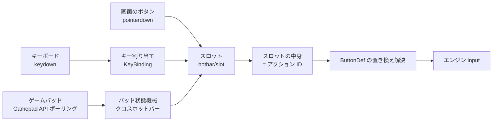
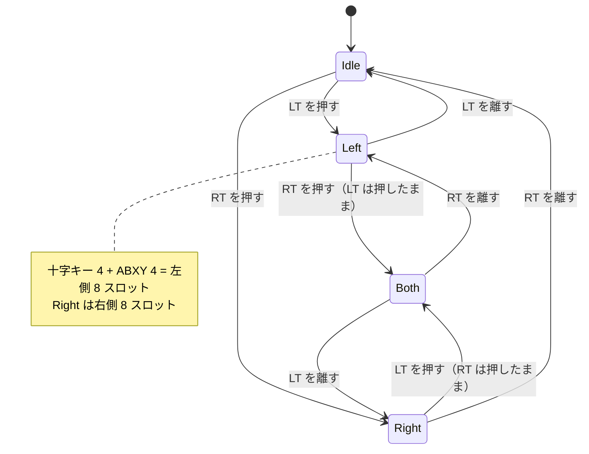
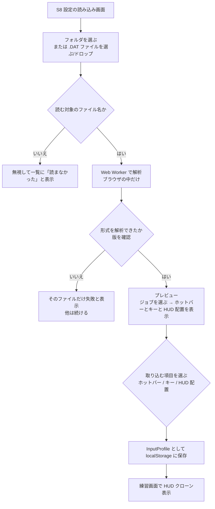

# INPUT_HUD — キーボード・パッド入力と HUD 配置のクローン

- 文書ステータス: Draft v0.1
- 前提: [SPEC.md](./SPEC.md), [STATE_MACHINE.md](./STATE_MACHINE.md), [GAME_DATA.md](./GAME_DATA.md), [SCREENS.md](./SCREENS.md)

## 1. 目的

| # | 目的 |
|---|------|
| 1 | ゲームと同じ操作で練習できるように、**キーボード**と**ゲームパッド**の両方に対応する |
| 2 | 手元の FF14 の**設定ファイルを読み込み**、ホットバーの中身・キー割り当て・HUD の配置をアプリ上に**再現（クローン）**する |
| 3 | 読み込んだ設定はブラウザの中だけで処理し、**サーバーへ送らない** |

> **設定ファイルの形式について**
> FF14 の設定ファイル（`*.DAT`）の形式は公開されていない。本書では**読み込みの仕組みと、アプリ内での持ち方**だけを設計する。
> ファイルのどこに何が入っているかは、実物のファイルで確かめてから決める。確かめるまでは推測で埋めず、`TODO(CFG-xx)` とする（§7）。

## 2. 入力の全体像

キーボード・パッド・画面のボタンの 3 つの入力を、**「スロット」への入力**にそろえてからエンジンへ渡す。



- **スロット**とは、ホットバーのマス 1 つのこと（`{ bar: 'hb1'..'hb10' | 'xhb1'..'xhb8', index }`）。
- スロットの中身は「ゲームのアクション ID」。アクション ID の置き換え（居合術 → 彼岸花 など）は、これまでどおり `ButtonDef` で解決する。
- エンジンから見ると、入力はこれまでと同じく「ボタンが押された」だけ。キーボードかパッドかの違いはエンジンに持ち込まない。
- 入力ログには、どの入力元（`source: 'keyboard' | 'gamepad' | 'pointer'`）から来たかを記録する。採点には使わず、結果画面の表示に使う。

## 3. キーボード

| 項目 | 設計 |
|------|------|
| 識別 | `KeyboardEvent.code`（配列に依存しない物理キー）＋ 修飾キー（Shift / Ctrl / Alt）。FF14 と同じく「Shift+1」のような組み合わせを割り当てられる |
| ブラウザとの衝突 | Ctrl+W、Ctrl+T など、ブラウザが先に処理して止められないキーは割り当て不可として警告する。それ以外は、練習中だけ `preventDefault()` する |
| 押しっぱなし | `repeat` の keydown は先行入力の更新として扱う（SPEC §6.1） |
| 設定の読み込み | 設定ファイルから、ホットバーのスロットとキーの対応を取り込む（§5）。取り込めなかったキーは既定値のまま |

## 4. ゲームパッド

### 4.1 読み取り方

- ブラウザの **Gamepad API** を使う。ボタンが押されたことを知らせるイベントはないため、**毎フレーム（`requestAnimationFrame`）状態を読み取って**、前のフレームとの差で「押した」を判定する。
- 入力時刻は読み取った時刻（`performance.now()`）とする。このため、キーボードより最大 1 フレーム（60Hz で約 16.7ms）遅れて判定されうる。結果画面には「パッド入力の時刻精度は ±1 フレーム」と表示する。
- `gamepad.mapping === 'standard'` のパッド（Xbox 系・DualSense など多くの機種）は、既定の割り当てがそのまま使える。`standard` でない機種は、割り当て画面でボタンを 1 つずつ押して登録する。
- ボタンの表記は、文字（例: `A` / `×`、`LT` / `L2`）で表示する。メーカーのボタン画像は使わない。
- 対応するのはページを表示している間だけ。タブが非表示になったら一時停止する（STATE_MACHINE §7）。ブログ記事に iframe で埋め込む場合は、`<iframe allow="gamepad">` が必要になる（DEPLOY §6）。

### 4.2 クロスホットバー（XHB）の状態機械

FF14 のパッド操作に合わせ、LT/RT（L2/R2）を押している間だけ、十字キーと ABXY（○×△□）がスロットになる。



- `Left` / `Right` のとき、十字キーまたは ABXY を押すと、対応するスロットの入力になる。
- `Both`（両方押し）のときにどのバーを使うかは、ゲームの設定によって変わる（TODO(CFG-06)）。MVP では、**後から押した側のバーを使う**。
- ダブルタップ（WXHB）と、バーの切り替え操作（セット切り替え）は MVP ではやらない。読み込んだ設定に含まれていたら、その旨を表示する。
- トリガーの「押した」とみなすしきい値（アナログ値）は、設定で調整できるようにする（既定値 0.5 は `app-policy`）。

### 4.3 パッドでの画面操作

練習中以外の画面操作（開始・リトライ・メニュー）も、パッドでできるようにする。

| 操作 | 既定の割り当て（案） |
|------|-------------------|
| 練習開始 / 決定 | Start（Options） |
| 一時停止 | Start（練習中） |
| リトライ | Select（Share）の長押し |
| メニュー移動 | 十字キー（練習中以外） |

## 5. 設定ファイルの読み込み

### 5.1 対象のファイル

FF14 はキャラクターごとの設定を、PC の次の場所に保存している。

```
ドキュメント\My Games\FINAL FANTASY XIV - A Realm Reborn\
├─ FFXIV_CHR<英数字>\          キャラクターごとのフォルダ
│   ├─ HOTBAR.DAT                ホットバーの中身（どのマスにどのアクションか）
│   ├─ KEYBIND.DAT               キー割り当て
│   ├─ ADDON.DAT                 HUD の配置（位置・大きさ・表示するかどうか）
│   ├─ ...
└─ FFXIV.cfg など                 全キャラクター共通の設定
```

| ファイル | 取り出したいもの | アプリでの使い道 | 形式 |
|---------|----------------|-----------------|------|
| `HOTBAR.DAT` | ジョブごとのホットバー 1〜10 とクロスホットバーの中身（アクション ID） | ボタンの並び | TODO(CFG-01) |
| `KEYBIND.DAT` | ホットバーの各スロットに割り当てたキー | キーボードの割り当て | TODO(CFG-02) |
| `ADDON.DAT` | ホットバー・キャストバー・ジョブゲージ・バフ表示・ターゲット情報などの位置・大きさ・表示するか | HUD の配置 | TODO(CFG-03) |
| パッドの設定（どのファイルかも未確認） | クロスホットバーの動作設定、ボタン割り当て | パッドの割り当て | TODO(CFG-04) |

**読まないファイル:** マクロ、チャットのログ、ギアセット、フレンドリストなど、練習に関係ないファイルは読まない。アプリは上の表のファイル名だけを受け付け、それ以外は選ばれても無視する。

### 5.2 読み込みの流れ



- ファイル選択は `<input type="file" webkitdirectory>`（フォルダごと選ぶ）と、`multiple`（ファイルを選ぶ）の両方に対応する。ドラッグ＆ドロップも受け付ける。
- 解析は **Web Worker** の中で行う。画面は固まらず、ファイルはどこにも送信しない（外部通信なしの方針。DEPLOY §7）。
- ファイルのサイズに上限を設ける（TODO(CFG-05) の実物サイズを見て決める。仮に 1 ファイル 2MB）。
- 保存するのは**解析した結果だけ**（アクション ID・キー・座標）。元のファイルは保存しない。
- キャラクターのフォルダ名（`FFXIV_CHR…`）は保存しない。プロフィール名はユーザーが付ける（既定値は「読み込んだ設定 1」）。

### 5.3 アクション ID の対応

- ホットバーのスロットに入っているのがアクションなら、その ID を第 1 層（`actions.json`）の ID として引く（同じゲームの ID なので、そのまま対応できる見込み。TODO(CFG-01) で確認）。
- アクション以外（マクロ・アイテム・一般アクション・空きなど）のスロットは「練習では使えないマス」として灰色で表示し、押しても何も起きない。
- 下位版のアクションが入っていた場合（刃風など）は、`upgradesFrom` をたどって Lv100 の上位版（暁風）として扱う（GAME_DATA §5.2）。
- 練習するジョブの `ButtonDef` に含まれないアクションは、灰色で表示する。
- 逆に、練習に必要なのにホットバーに入っていないアクション（開幕回しで使うもの）は、読み込み時に警告し、空いているマスに置くか、画面の外に「未配置」バーを出すかを選べるようにする。

## 6. HUD 配置のクローン

### 6.1 再現する要素

| HUD 要素（ゲーム） | アプリの部品（SCREENS §3 の番号） | MVP |
|-------------------|----------------------------------|-----|
| ホットバー 1〜10 | ⑨ スキルボタン | ✅ |
| クロスホットバー | ⑨（パッドの配置） | ✅ |
| ジョブゲージ | ④ | ✅ |
| バフ・デバフ表示 | ②③ | ✅ |
| キャストバー | ⑦（詠唱バー） | ✅ |
| ターゲット情報 | ②（敵の欄） | 位置だけ |
| それ以外（チャット・地図など） | 表示しない | — |

### 6.2 座標の変換

- ゲームの座標は、ゲームの画面解像度を基準にしていると考えられる（TODO(CFG-03)）。アプリでは、読み込んだ座標を **0〜1 の比率** に変換して保存する（`HudLayout`）。
- 表示するときは、アプリの表示領域（ブラウザの画面）に比率を掛けて置く。縦横比が違う場合は、ゲームの縦横比のまま全体を縮小して中央に置く（レターボックス）。
- 要素の大きさ（ゲームの「サイズ」設定）も比率で持ち、画面の大きさに合わせて拡大・縮小する。

### 6.3 表示モード

| モード | 内容 | 使う場面 |
|--------|------|---------|
| 標準レイアウト | SCREENS §3 のレイアウト | 設定を読み込んでいない、スマートフォン |
| **HUD クローン** | 読み込んだ `HudLayout` のとおりに配置。背景は暗い単色（木人の位置だけ中央に表示） | PC で、ゲームに近い見た目で練習したいとき |
| 混合 | ボタンの並び・キーは読み込んだもの、配置は標準 | 狭い画面 |

- 画面の幅が 1024px 未満では HUD クローンを選べない（ゲームの HUD はスマートフォンの画面に収まらないため）。
- ミス理由・お手本・入力履歴など、ゲームにない部品は HUD クローンでも表示する。置き場所は画面の端に固定し、ドラッグで動かせるようにする（位置は `HudLayout` に保存）。

## 7. 未確定事項

| ID | 内容 | 確かめ方 |
|----|------|---------|
| CFG-01 | `HOTBAR.DAT` の形式（ヘッダー、暗号化・難読化の有無、スロットの並び、アクション ID と種類の表し方、ジョブごとの共有設定） | 管理者の実物ファイルで確かめる |
| CFG-02 | `KEYBIND.DAT` の形式、ホットバーのスロットとキーの対応の表し方 | 同上 |
| CFG-03 | `ADDON.DAT` の形式、座標の基準（解像度・画面端からの位置）、HUD 要素の識別子 | 同上 |
| CFG-04 | パッドの割り当てとクロスホットバーの設定がどのファイルにあるか | 同上 |
| CFG-05 | 各ファイルのサイズと、パッチによる形式変更の頻度 | 同上 |
| CFG-06 | クロスホットバーで LT と RT を両方押したときの挙動（設定による違い） | ゲーム内で確認 |
| CFG-07 | 実物ファイルをどうやって開発に使うか（§8） | 管理者と決める |

## 8. 実物ファイルの扱い（開発時）

- 設定ファイルには、キャラクターを識別できる情報や、個人の設定が入っている可能性がある。**このリポジトリは公開されているため、実物ファイルをそのままコミットしない。**
- 形式の調査は、次のどちらかで行う（CFG-07）。
  1. 管理者の PC 上で Claude Code を動かし、ローカルで調べる。調べた結果（形式の説明と、個人情報を含まない最小限のテスト用データ）だけをコミットする。
  2. 管理者がファイルの中身を確認し、個人情報を消した、または作り直したサンプルファイルを用意してコミットする。
- テストでは、形式の説明をもとに作った**合成のテスト用ファイル**（`test/fixtures/cfg/`）を使う。
