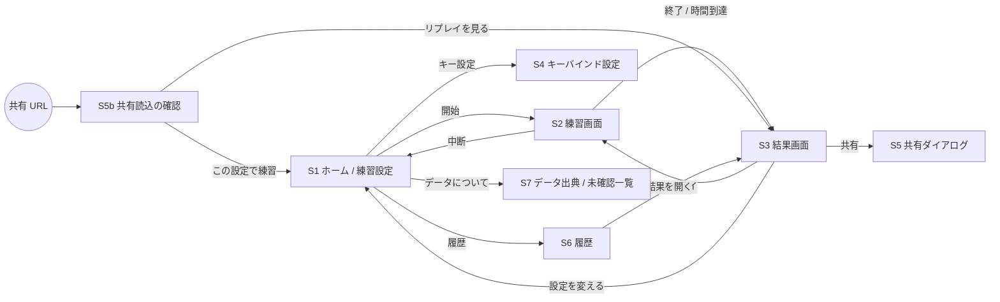

# SCREENS — 画面構成図

- 文書ステータス: Draft v0.1
- 前提: [SPEC.md](./SPEC.md)
- 図中のアクション名は `[GCD1]` `[oGCD1]` のような **プレースホルダ**。実際の名称・並びは侍データ確定後に決める（TODO(GAME-10)）。
- アイコンはすべて「文字 + CSS」の仮アイコン（例: 角丸の四角に 1〜2 文字、GCD/oGCD で枠の形を変える）。

## 1. 画面一覧と遷移



| ID | 画面 | ルート（ハッシュ） |
|----|------|------------------|
| S1 | ホーム / 練習設定 | `#/` |
| S2 | 練習画面 | `#/practice` |
| S3 | 結果画面 | `#/result/:historyId` または `#/result/shared` |
| S4 | キーバインド設定 | `#/keybinds` |
| S5 | 共有ダイアログ | （S3 上のモーダル） |
| S5b | 共有読込の確認 | `#/share?d=...` |
| S6 | 履歴 | `#/history` |
| S7 | データ出典 / 未確認一覧 | `#/about` |

### 埋め込み表示（`?embed=1`）

ブログ記事に同一オリジンの iframe で埋め込む場合の表示（[DEPLOY.md §6](./DEPLOY.md#6-ブログとの連携)）。

- ヘッダーを 1 行に縮め、フッターを省略する。右上に「全画面で開く ↗」（同じ設定で単独ページを新しいタブで開く）。
- 初期状態では「クリックしてキー入力を有効化」のオーバーレイを表示し、クリック/タップで iframe にフォーカスを移す。
- 高さは記事側の iframe に合わせる（推奨: PC 720px / スマートフォンは単独ページへのリンクを推奨）。

```
┌ ブログ記事 ─────────────────────────────────────┐
│ ...本文...                                       │
│ ┌ iframe ────────────────────────────────────┐ │
│ │ 侍 Lv100 ガイド練習   00:00/02:00  [全画面↗] │ │
│ │          ┌─────────────────────────┐       │ │
│ │          │ クリックしてキー入力を有効化 │       │ │
│ │          └─────────────────────────┘       │ │
│ │ [G1][G2][G3] ... [o1][o2] ...               │ │
│ └────────────────────────────────────────────┘ │
│ ...本文...                                       │
└─────────────────────────────────────────────────┘
```

## 2. S1 ホーム / 練習設定

### PC

```
┌──────────────────────────────────────────────────────────────────────┐
│ FF14 Rotation Trainer (非公式)                   [履歴] [キー設定] [?] │
├──────────────────────────────────────────────────────────────────────┤
│  ジョブ   [ 侍 Lv100 ▼ ]   ⚠ データ未整備（未確認 12 件） → 詳細       │
│                                                                      │
│  モード   (●) ガイド練習   ( ) 自由練習                                │
│  時間     [ 120 ] 秒                                                  │
│  開幕回し [ （出典名）▼ ]  [自作する]                                  │
│                                                                      │
│  ▼ ガイド設定                                                         │
│     誤入力時  (●) 止める  ( ) 続行      速度 [1.0x ▼]  先読み表示 [3]   │
│  ▶ 詳細設定（GCD / アニメーションロック / 先行入力の上書き）           │
│                                                                      │
│               [  練習開始 (Space)  ]    [共有URLを読み込む]            │
│                                                                      │
│  前回 78 点 / 自己ベスト 85 点                                         │
├──────────────────────────────────────────────────────────────────────┤
│ 非公式ファンツール。株式会社スクウェア・エニックスとは関係ありません。(文面 TODO(LEGAL-01)) │
│ nettoge.com トップ ／ 解説記事                                         │
└──────────────────────────────────────────────────────────────────────┘
```

### スマートフォン（縦）

```
┌──────────────────────────┐
│ Rotation Trainer   [≡]   │
├──────────────────────────┤
│ ジョブ [侍 Lv100 ▼]      │
│ ⚠ データ未整備 → 詳細    │
│ モード [ガイド|自由]     │
│ 時間   [120] 秒          │
│ 開幕   [（出典名）▼]     │
│ ▶ ガイド設定             │
│ ▶ 詳細設定               │
│                          │
│ ┌──────────────────────┐ │
│ │      練習開始         │ │
│ └──────────────────────┘ │
│ 前回 78 / ベスト 85      │
└──────────────────────────┘
```

## 3. S2 練習画面

### PC（横長、1024px 以上）

```
┌──────────────────────────────────────────────────────────────────────────────┐
│ ① 00:42.3 / 02:00   残り 77.7s   [ガイド]  [⏸ 一時停止] [✕ 中断] [↻ リトライ]   │
├───────────────────────────────┬──────────────────────────────────────────────┤
│ ② 敵（木人）                   │ ⑤ お手本（ガイドモードのみ）                  │
│   デバフ: [D1 18.2] [D2 4.1⚠] │   次 ▶ ┏━━━━━━┓   その後: [G2] [o3] [G3]     │
│                               │        ┃ GCD1 ┃                              │
│ ③ 自己バフ                     │        ┗━━━━━━┛                              │
│   [B1 12.0] [B2 x3] [B3 40.5] │                                              │
│                               │ ⑥ ミス理由                                    │
│ ④ ジョブゲージ                 │   ✕ アビリティの挟みすぎで GCD が 0.3 秒遅れ │
│   ゲージA ████████░░ 80/100   │                                              │
│   フラグ  [●][○][●]            │                                              │
│   スタック ◆◆◇                 │                                              │
├───────────────────────────────┴──────────────────────────────────────────────┤
│ ⑦ GCD  ◔ 1.2s   詠唱 ▓▓▓░░ 0.6s   ロック ▓░ 0.2s   コンボ: [G1]→[G2]→( ) 残り 24s │
├──────────────────────────────────────────────────────────────────────────────┤
│ ⑧ タイムライン（過去 15 秒 ← 現在）                                            │
│   GCD : |G1   |G2   |G3  ▲idle|G1   |                                         │
│   oGCD:    o1 o2     o3 o4 ✕clip                                              │
├──────────────────────────────────────────────────────────────────────────────┤
│ ⑨ スキルボタン                                                                │
│   GCD : [1 G1] [2 G2] [3 G3] [4 G4] [5 G5] [6 G6]                             │
│   oGCD: [Q o1 12] [E o2 ②] [R o3] [F o4 45] [Z o5] [X o6]                     │
│   ※ 左上 = キー、右下 = リキャスト残り秒 / チャージ数、暗転スイープでリキャスト表示  │
├──────────────────────────────────────────────────────────────────────────────┤
│ ⑩ 入力履歴（折りたたみ可）                                                     │
│   42.1s  G3  ✓            41.0s  o2  ⚠ 3 回目のウィーブ                       │
│   39.6s  G2  ✓            38.9s  G1  ✕ コンボ切れ（前段なし）                  │
└──────────────────────────────────────────────────────────────────────────────┘
```

### スマートフォン（縦、360px〜）

親指で届く下半分にボタンを集め、情報は上半分に圧縮する。入力履歴とタイムラインは既定で折りたたむ。

```
┌──────────────────────────┐
│① 00:42 / 02:00  [⏸][✕]  │
│② 敵 [D1 18][D2 4⚠]       │
│③ 自 [B1 12][B2x3][B3 40] │
│④ ゲージA ████████░░ 80   │
│   [●][○][●]  ◆◆◇         │
├──────────────────────────┤
│⑤ 次 ▶ [ GCD1 ]  [G2][o3] │
│⑥ ✕ GCD が 0.3 秒遅れ     │
│⑦ GCD ◔1.2  コンボ G1→G2  │
├──────────────────────────┤
│⑧ ▶ タイムライン/履歴      │
├──────────────────────────┤
│⑨ oGCD                    │
│ [o1 12][o2②][o3 ][o4 45] │
│ [o5   ][o6  ]            │
│   GCD                    │
│ [ G1 ][ G2 ][ G3 ]       │
│ [ G4 ][ G5 ][ G6 ]       │
└──────────────────────────┘
```

| 番号 | 要素 | 対応機能（SPEC §6） | 備考 |
|------|------|--------------------|------|
| ① | 経過時間・残り時間・操作 | 2 | カウントダウン中は中央に大きく「3・2・1」をオーバーレイ（機能 1） |
| ② | 敵デバフ / DoT | 7 | 残り時間が閾値以下で警告色 + ⚠ 記号 |
| ③ | 自己バフ | 7 | スタック数表示 |
| ④ | ジョブゲージ | 6 | `ResourceDef.kind` に応じてバー / フラグ / スタックを自動描画 |
| ⑤ | お手本 | 9 | 自由練習では非表示 |
| ⑥ | ミス理由 | 10 | `aria-live="polite"`。一定時間で薄くなる |
| ⑦ | GCD・詠唱・ロック・コンボ | 2, 4 | GCD は円形スイープ、詠唱/ロックはバー |
| ⑧ | タイムライン | 8 | 停止（idle）・クリップをマーカー表示 |
| ⑨ | スキルボタン | 3, 5 | `pointerdown` で発火、`touch-action: manipulation`。最小 44×44px |
| ⑩ | 入力履歴 | 8 | ✓ / ⚠ / ✕ の記号で色に依存しない |

### ボタンの仮アイコン（CSS）

```
 GCD（角丸四角）        oGCD（円）         リキャスト中            チャージあり
┌────────┐           ╭──────╮          ┌────────┐            ╭──────╮
│   G1   │           │  o1  │          │▒▒ G1 ▒▒│ 12         │  o2  │②
└────────┘           ╰──────╯          └────────┘            ╰──────╯
 1 キー表示は左上      色はジョブ色       conic-gradient で残り表示   右下に数字
```

- 文字は `ActionDef.label`（1〜2 文字）。色はジョブテーマ色の CSS 変数。
- 置き換え中（アイコン置き換え）のボタンは枠を光らせ、ラベルを置き換え先に変更。
- 使用不可（条件未達）は彩度を下げる。お手本の次ボタンは太枠 + パルス（`prefers-reduced-motion` 時は静的な太枠のみ）。

## 4. S3 結果画面

```
┌──────────────────────────────────────────────────────────────────┐
│ 結果  侍 Lv100 / ガイド練習 / 120 秒 / 開幕:（出典名）             │
│ ⚠ 一時停止あり  ⚠ GCD 値を上書き（xxxx ms）                         │
├──────────────────────────────────────────────────────────────────┤
│   総合  78 点  ランク B        前回 72 (+6)   ベスト 85 (-7)       │
├──────────────────────────────────────────────────────────────────┤
│ 項目                  点数   内訳                                  │
│ GCD 稼働率            92    停止 2.4s（3 回）            [表示]      │
│ スキル順              85    お手本 24 手中 21 手一致      [表示]      │
│ コンボ切れ            80    2 回（前段なし 1 / 時間切れ 1）[表示]     │
│ クリップ              70    合計 0.9s（4 回）             [表示]      │
│ バフ・DoT 維持         88    B1 96% / D1 81%（切れ 1 回）  [表示]      │
│ リソースあふれ         75    ゲージA 20 / フラグ重複 1      [表示]      │
│ 主要アクション回数     100   o1 2/2, o3 4/4                          │
│ 開幕回しからのずれ     60    7 手目からずれ / 平均 +0.4s   [表示]      │
├──────────────────────────────────────────────────────────────────┤
│ タイムライン（全体・ズーム可）  ▲停止 ✕クリップ ◇コンボ切れ ●バフ切れ │
│ 0s ─────────────────────────────────────────────── 120s          │
├──────────────────────────────────────────────────────────────────┤
│ [↻ リトライ]  [設定を変える]  [共有]  [JSON で保存]                  │
└──────────────────────────────────────────────────────────────────┘
```

- [表示] を押すとタイムラインの該当箇所へスクロールし、マーカーを強調。
- スマートフォンでは項目を縦のカード列にし、タイムラインは横スクロール。

## 5. S4 キーバインド設定

```
┌──────────────────────────────────────────────┐
│ キーバインド（侍 Lv100）          [既定に戻す] │
├──────────────────────────────────────────────┤
│ ボタン       キー                              │
│ [G1]         [ 1 ]  ← クリックして新しいキーを押す │
│ [G2]         [ 2 ]                             │
│ [o1]         [ Q ]   ⚠ [o5] と重複              │
│ ...                                            │
│ 一時停止      [ Esc ]   リトライ [ R ]（Shift 併用） │
└──────────────────────────────────────────────┘
```

## 6. S5 共有ダイアログ / S5b 共有読込

```
┌───────────────────────────────────────┐   ┌───────────────────────────────────────┐
│ 共有                                   │   │ 共有された練習を開く                    │
│ (●) 練習設定のみ   ( ) 入力ログも含める │   │ 侍 Lv100 / 自由練習 / 120 秒            │
│ URL: [https://…#/share?d=z.xxxx] [コピー]│   │ 開幕: （出典名）                         │
│ [JSON ファイルをダウンロード]           │   │ ⚠ データ版が異なります（結果が変わる可能性）│
│ ※ URL が長い場合は JSON を推奨         │   │ [この設定で練習]  [リプレイを見る] [閉じる] │
└───────────────────────────────────────┘   └───────────────────────────────────────┘
```

## 7. S6 履歴 / S7 データ出典

```
S6 履歴                                         S7 データについて
┌───────────────────────────────────┐          ┌──────────────────────────────────────┐
│ 日時          モード  総合  ランク │          │ 侍 Lv100  データ版 sam-lv100-draft-1  │
│ 09/24 21:03  ガイド   78    B     │          │ 準拠パッチ: 未確認                     │
│ 09/24 20:55  ガイド   72    C     │          │ 出典: （一覧）                          │
│ ...                   [全削除]    │          │ 未確認項目: GAME-01 GCD 基本値 ...      │
└───────────────────────────────────┘          │ 非公式表記 / ライセンス                 │
                                               └──────────────────────────────────────┘
```

## 8. レスポンシブ方針

| 幅 | レイアウト |
|----|-----------|
| 〜599px | 1 カラム。ボタンは下部固定、情報は上部。履歴/タイムラインは折りたたみ |
| 600〜1023px | 上下 2 段。ボタンは下部に横並び |
| 1024px〜 | S2 の PC レイアウト（左: 状態、右: ガイド/ミス、下: ボタン） |

- 縦画面・横画面の切り替えで状態を失わない（状態はエンジン側）。
- 練習中は画面スリープ防止（Wake Lock API が使える場合のみ、失敗しても無視）。
