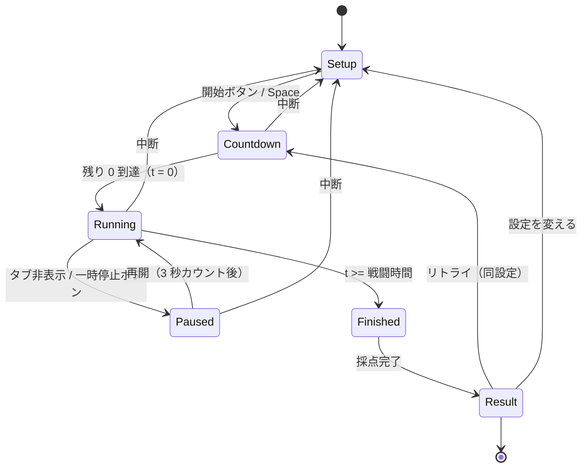
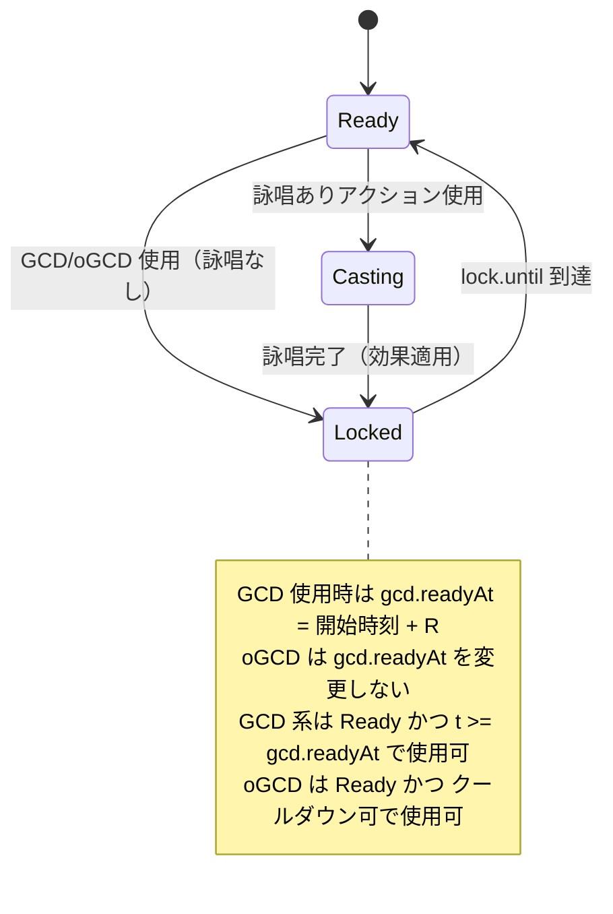
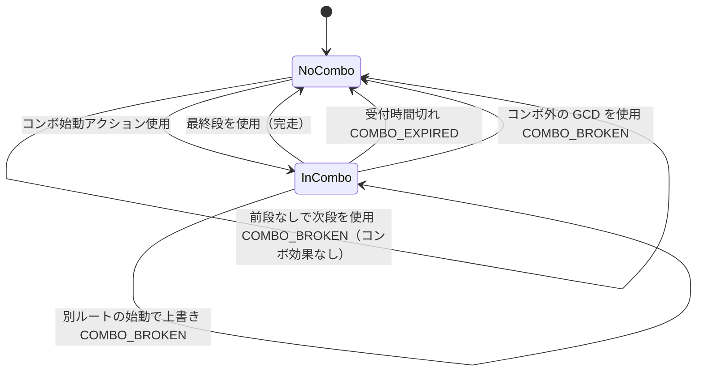
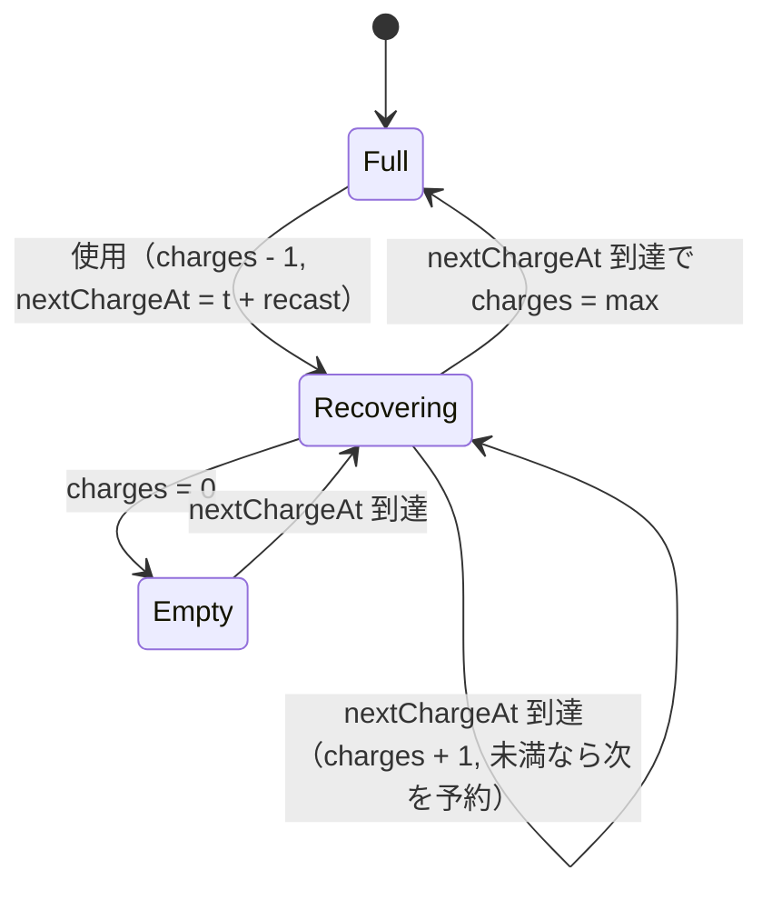
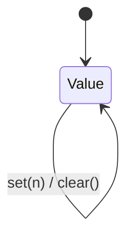
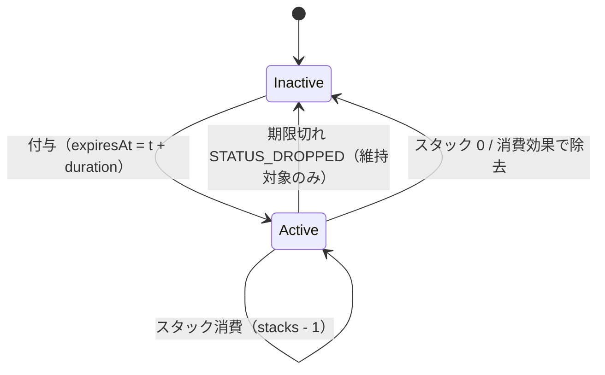
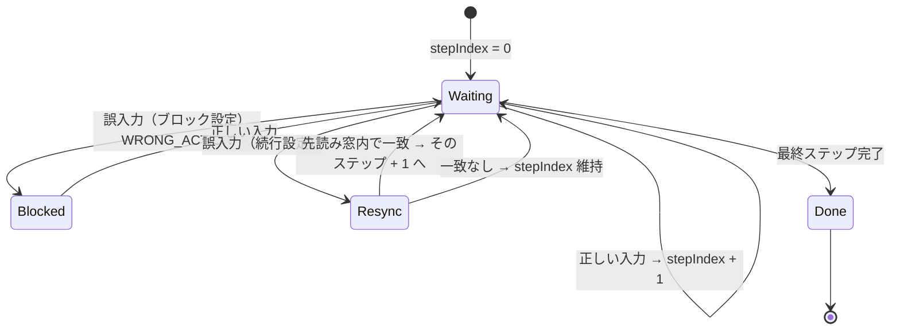
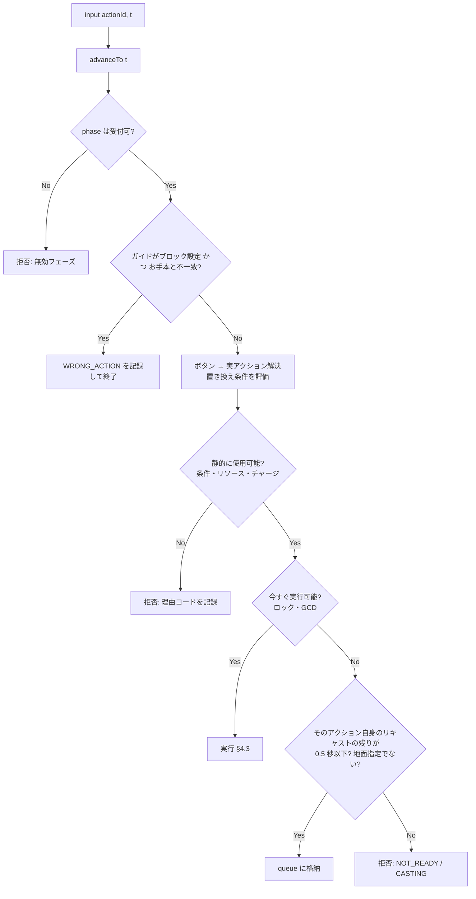

# STATE_MACHINE — 状態遷移設計

- 文書ステータス: Draft v0.1
- 前提: [SPEC.md](./SPEC.md)。具体的な数値（GCD・ロック・受付時間など）はすべてデータ/設定から与えられ、本書では記号で表す。

本アプリの状態は 2 層に分ける。

| 層 | 責務 | 実装場所（予定） | React 依存 |
|----|------|-----------------|-----------|
| セッション層 | 画面の進行（準備 → カウントダウン → 戦闘 → 結果） | `src/app/session/` | あり（hooks） |
| シミュレーション層 | 仮想時計・GCD・コンボ・リキャスト・ゲージ・ステータス・入力キュー | `src/engine/` | **なし（純粋 TS）** |

シミュレーション層は **純粋関数の reducer** とし、`(state, command) => state` の形で決定的に動作する。UI は `tick` と `input` のコマンドを送るだけで判定ロジックを持たない。

---

## 1. セッション状態



| 状態 | 仮想時計 | 入力 | 備考 |
|------|---------|------|------|
| `Setup` | 停止 | 設定変更のみ | 共有 URL 読込時はここに設定を反映 |
| `Countdown` | `-3000 → 0` と進む | プリプル許可アクションのみ受付（TODO(GAME-30)）。それ以外は `CONDITION_UNMET` で拒否 | カウントダウン自体も仮想時計上の時間（負の時刻）として扱う |
| `Running` | 進行 | 全アクション受付 | |
| `Paused` | 停止 | 無効 | 一時停止した試行は結果に「一時停止あり」と記録 |
| `Finished` | 停止 | 無効 | 戦闘終了時点で未完了の詠唱は破棄 |
| `Result` | 停止 | 無効 | 入力ログから再シミュレーションして採点（§8） |

---

## 2. シミュレーション状態（SimState）

型の詳細は [DATA_SCHEMA.md §4](./DATA_SCHEMA.md#4-ランタイム型エンジン内部) を参照。ここでは状態の構成要素と遷移のみ記す。

```
SimState
├─ t                  仮想時刻 (ms, 整数, カウントダウン中は負)
├─ phase              'countdown' | 'combat' | 'ended'
├─ gcd                { readyAt, lastStartAt, lastRecastMs }
├─ lock               { until, kind: 'none' | 'animation' | 'cast', castingActionId? , causedBy: 'gcd' | 'ogcd' }
├─ combo              { lastComboActionId | null, expiresAt | null }
├─ cooldowns          { [cooldownGroupId]: { charges, maxCharges, nextChargeAt | null } }
├─ resources          { [resourceId]: number }        ゲージ・スタック・フラグ(0/1) を統一表現
├─ statuses           { [statusId]: { target, expiresAt, stacks } }
├─ queue              QueuedInput | null               先行入力 1 件
├─ guide              { stepIndex } | null
├─ pendingEffects     詠唱完了時などに遅延適用する効果
└─ events             SimEvent[]                       追記のみ（採点・表示の唯一の情報源）
```

### 2.1 コマンド

| コマンド | 発生元 | 内容 |
|---------|--------|------|
| `advanceTo(t)` | UI の rAF ループ | 仮想時刻を `t` まで進め、その間に予定された内部イベントを**予定時刻どおり**に処理する |
| `input(actionId, t)` | ボタン / キー | `advanceTo(t)` を行ってから入力処理（§4） |
| `end()` | セッション層 | 戦闘終了処理 |

### 2.2 同一時刻の処理順序（決定性のための規則）

`advanceTo(t)` は、`t` 以前に予定された内部イベントを時刻順に処理する。同時刻の場合は次の順で処理する。

1. 詠唱完了（`pendingEffects` の適用）
2. ステータス期限切れ（`statuses[*].expiresAt <= 時刻`）
3. コンボ期限切れ
4. チャージ回復（`cooldowns[*].nextChargeAt <= 時刻`）
5. ロック解除 → キューの実行を試行（§4.2）
6. 戦闘時間到達 → `phase = 'ended'`

> **フレーム時刻ではなく予定時刻で処理する。** 例: ロック解除が t=2400 でも UI の tick が t=2413 に来た場合、キューされた入力は t=2400 に実行されたものとして記録する。これにより描画フレームレートによって採点が変わらない。

---

## 3. 要素別の状態遷移

### 3.1 GCD とアニメーションロック

記号: `R` = そのアクションの GCD リキャスト（データ＋スキルスピード/ヘイスト補正。TODO(GAME-01〜03)）、`L` = アニメーションロック（TODO(GAME-04)）、`C` = 詠唱時間（TODO(GAME-07)）。



- GCD 使用時: `gcd.lastStartAt = t`, `gcd.readyAt = t + max(R, C + L_after_cast)`（詠唱時間がリキャスト以上なら、詠唱完了＋0.1 秒の後）、`lock.until = t + (C > 0 ? C + L_after_cast : L)`。
- oGCD 使用時: `lock.until = t + L`, `lock.causedBy = 'ogcd'`。
- 値（仮。[SPEC.md §6.3](./SPEC.md#63-通信遅延アニメーションロックの扱い)）: `L` = 0.6 秒＋応答の遅れ（設定、既定 50ms。例外は夜天 0.8 秒）、`L_after_cast` = 0.1 秒（応答の遅れは足さない）。
- 詠唱中に動くと（残りが 0.5 秒より多いとき）`Casting → Ready` に戻り、`gcd.readyAt = t` にする（GCD が戻る）。残りが 0.5 秒を切ったら中断されない（滑り撃ち。[SPEC.md §6.4](./SPEC.md#64-詠唱と滑り撃ち)）。

#### 3.1.1 GCD 停止とクリップの判定（GCD 開始時に確定）

次の GCD を時刻 `s` に開始したとき、`gap = s - gcd.readyAt` とする（`gap <= 0` なら何もしない）。

```
lockOverrun = max(0, min(s, ogcdLockEnd) - gcd.readyAt)
    ogcdLockEnd = 直前の GCD 開始以降に使った oGCD によるロックの最終解除時刻
    （止まっていた後に押した oGCD なら、gcd.readyAt の代わりにその oGCD を押した時刻から数える）
clipMs = lockOverrun          … oGCD を挟みすぎたことによる遅れ → CLIPPED
idleMs = gap - clipMs         … 何も押していなかった遅れ   → GCD_IDLE
```

- 同じギャップに両方が含まれうる（挟みすぎた上に、さらに押し遅れた等）。
- 戦闘終了時点で GCD が `Ready` のまま待機していた時間も `idleMs` に加算する（終了時に確定）。
- 最初の GCD 前（t=0 から最初の GCD まで）を `idle` に含めるかは `ScoringProfile.countIdleBeforeFirstGcd`（既定 true）。
- ウィーブ数（GCD 間に使った oGCD の数）も `WEAVE_COUNT` イベントとして記録し、採点ポリシーの閾値（DESIGN-01）で警告を出す。

### 3.2 コンボ



- コンボ定義はアクションデータの `combo: { from: ActionId[] }` で表す（[DATA_SCHEMA.md §2.2](./DATA_SCHEMA.md#22-action)）。
- 「コンボ外の GCD」でコンボが切れるか、どの GCD が切らないかはゲーム仕様のため、アクションデータの `breaksCombo: boolean` で持つ（TODO(GAME-06, 16)）。
- コンボ省略効果（特定のバフ中はコンボ条件を満たしたものとみなす）は `combo.bypassedByStatus: StatusId[]` で表す（TODO(GAME-16)）。
- oGCD はコンボ状態を変更しない（データで上書き可能にはしない）。

### 3.3 リキャストとチャージ



- チャージなしのアクションは `maxCharges = 1` として同じ機構で扱う。
- 複数アクションがリキャストを共有する場合は `cooldownGroupId` を共有する。
- リキャストを短縮/リセットする効果は `Effect` の `reduceCooldown` / `resetCooldown` で表す。
- `Full` の滞在時間は `CHARGES_CAPPED` として集計（戦闘開始から最初に使うまでは `ScoringProfile` の猶予時間を差し引く）。

### 3.4 リソース（ジョブゲージ・スタック・フラグ）

すべて `resources[id]: number` で統一して扱う。

| 種別 | 表現 | 例（侍で想定される形式。名称・値は TODO(GAME-12〜14)） |
|------|------|------|
| 数値ゲージ | `0..max` の整数 | 汎用の数値ゲージ |
| スタック | `0..max` の整数 | 汎用のスタック |
| フラグ | `0 / 1` | 「閃」相当の各フラグ（種類数は要確認） |



- フラグに `gain(1)` を行い既に 1 だった場合も overcap（重複付与）として記録する。
- 「フラグの個数」で使えるアクションが変わる仕様（居合術の種類など）は、`Condition` の `resourceCountAtLeast` / `resourceSumEquals` で表す（TODO(GAME-13, 15)）。

### 3.5 ステータス（バフ・デバフ・DoT）



- 再付与の方式 `refreshMode`: `'replace'`（残り時間を上書き）/ `'extend'`（加算、上限あり）/ `'ignore'`。ゲーム側の挙動は TODO(GAME-11)。
- 維持対象ステータス（`ScoringProfile.trackedStatuses`）について、上書き時に残っていた時間を `STATUS_EARLY_REFRESH`（無駄時間）として記録する。「早すぎ」とみなす閾値は採点ポリシー。
- DoT のダメージ計算は行わない（稼働時間のみ評価）。

### 3.6 ガイド



- ブロック設定の誤入力はシミュレーションへ渡さない（イベントには `WRONG_ACTION` のみ記録）。
- 「正しい入力」はアクション ID の一致で判定する。1 ボタンが状態により別アクションになる場合（TODO(GAME-15)）は、**ボタン ID ではなく解決後のアクション ID** で比較する。

---

## 4. 入力処理フロー

### 4.1 入力の受付



- 受付の前に、queue が空でなければ入力を無視する（先勝ち。`QUEUE_IGNORED` を 1 回だけ記録）。
- 「リキャストの残り」は、GCD なら `gcd.readyAt - t`、固有のリキャストがあればその残り（チャージ制は次のチャージまで）。アニメーション硬直と詠唱の残りは含めない（[SPEC.md §6.1](./SPEC.md#61-入力仕様詳細)）。

### 4.2 キューの実行

- ロック解除・GCD 準備完了・チャージ回復のいずれかの時刻に、キューされた入力を再評価する。
- 実行時点で再度「静的に使用可能」かを確認し、不可ならキューを破棄して拒否理由を記録する（例: その間にコンボが切れた）。
- キューの条件は GCD・oGCD とも同じ規則（そのアクション自身のリキャストの残り ≤ 0.5 秒）。値は仮（GAME-05）で、データで差し替え可能にする。
- 詠唱中に押した oGCD は、詠唱完了＋0.1 秒の硬直が明けた瞬間に出る。詠唱中の GCD は、GCD の残りが 0.5 秒以下になるまで受け付けない（詠唱時間がリキャストより短い技では、詠唱中には受け付けない）。

### 4.3 実行

1. GCD の場合は §3.1.1 のクリップ/停止判定を確定。
2. コスト消費（リソース・チャージ）。
3. リキャスト開始、GCD 開始（GCD の場合）。
4. ロック設定。詠唱ありなら `pendingEffects` に効果を積み、詠唱完了時に 5〜6 を行う。与ダメージ上昇は、滑り撃ちの時点（詠唱終了の 0.5 秒前）の値を使う。
5. コンボ判定（§3.2）とコンボ効果の選択。
6. 効果（`Effect[]`）を順に適用: ステータス付与/除去、リソース増減、リキャスト変更、コンボ状態更新。
7. `ACTION_EXECUTED` イベントを記録し、ガイドを進める。

---

## 5. イベント（SimEvent）

エンジンが出力するイベントは採点と表示の唯一の情報源とする。代表的なもの:

| イベント | 主な payload |
|---------|-------------|
| `ACTION_EXECUTED` | actionId, t, isGcd, comboApplied |
| `INPUT_REJECTED` | actionId, t, reason, detail |
| `INPUT_QUEUED` / `QUEUE_DROPPED` | actionId, t |
| `CAST_STARTED` / `CAST_COMPLETED` | actionId, t |
| `GCD_IDLE` | from, to, ms |
| `CLIPPED` | from, to, ms, weaveCount |
| `WEAVE_COUNT` | gcdIndex, count |
| `COMBO_BROKEN` / `COMBO_EXPIRED` | cause, t |
| `STATUS_APPLIED` / `STATUS_REFRESHED` / `STATUS_EXPIRED` / `STATUS_REMOVED` | statusId, t, wastedMs |
| `RESOURCE_CHANGED` / `RESOURCE_OVERCAP` | resourceId, delta, overflow |
| `CHARGES_CAPPED_START` / `CHARGES_CAPPED_END` | cooldownGroupId, t |
| `WRONG_ACTION` | expected, actual, t |
| `COMBAT_ENDED` | t |

---

## 6. 再現性（リプレイ）

- セッション層は、実際に受け付けた入力 `{ t, actionId }` を **入力ログ** として保存する。
- 採点は `simulate(practiceConfig, jobData, inputLog)` の結果イベント列から行う。リアルタイム中の表示に使ったイベント列と一致することをテストで保証する（[TEST_PLAN.md](./TEST_PLAN.md) U-REPLAY）。
- 共有 URL に入力ログを含めれば、受け取った側で同じ結果を再現できる。

## 7. 一時停止とタブ非表示

- `visibilitychange` で `hidden` になったら即 `Paused`。rAF の停止による時間の飛びを仮想時計へ反映しない。
- 再開時は 3 秒カウントダウンを挟む（仮想時計は止めたまま）。

## 8. 未確定事項（本書由来）

| ID | 内容 |
|----|------|
| GAME-04 / 07 | 硬直の値（仮: 0.6 秒＋応答の遅れ、詠唱の後 0.1 秒）。サーバーの値でクライアントのデータにない |
| GAME-05 | 先行入力（仮: リキャストの残り 0.5 秒・1 件・先勝ち）。押しっぱなしの扱い |
| GAME-06 / 16 | どの GCD がコンボを切るか / コンボ省略効果の範囲 |
| GAME-09 | 効果の付与タイミング（使用時 / 詠唱完了時 / 着弾時） |
| GAME-15 | アイコン置き換え（1 ボタン複数アクション）の条件 |
| DESIGN-01 | ウィーブ数の警告閾値、早期更新の閾値 |
